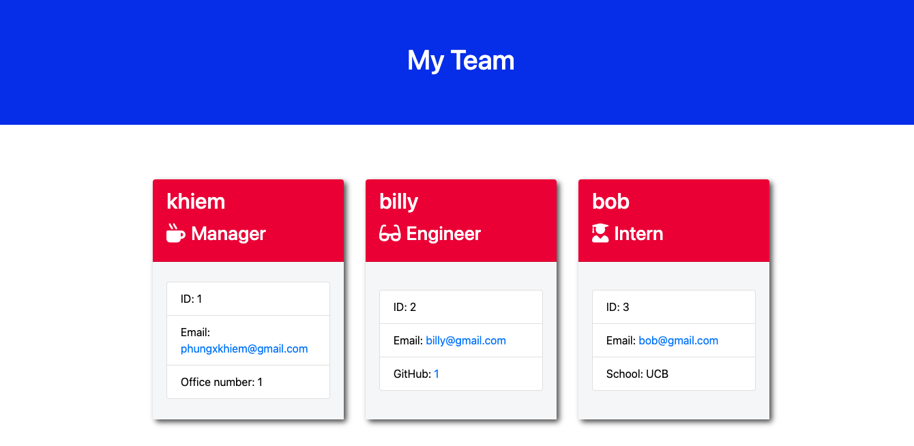

# GetYourTeamOrganized
Welcome to the README file for my GetYourTeamOrganized application. Below is all the information needed to fully understand this application.
license!
License: ISC

# Table of Contents
Description

Installation

Usage

WalkThrough-Video

Testing

Future

Questions

# Description
The application can be used through a terminal as long as the user has node.js installed. The LTS version is recommended. A few more packages are required to run this application. If the user downloads this repository the packages are included. More information on the packages needed are in the Installation section of this README. This application is intended to help an employer generate an HTML file with their emplyees information. It generates one manager employee card and as many engineer and intern employee cards as the user desires. The 'usage' section will walk the user through the process. For further help a walk through video is provided in the 'WalkThrough-Video' section.

# ScreenShots




# Acceptance Criteria
```
GIVEN a command-line application that accepts user input
WHEN I am prompted for my team members and their information
THEN an HTML file is generated that displays a nicely formatted team roster based on user input
WHEN I click on an email address in the HTML
THEN my default email program opens and populates the TO field of the email with the address
WHEN I click on the GitHub username
THEN that GitHub profile opens in a new tab
WHEN I start the application
THEN I am prompted to enter the team manager’s name, employee ID, email address, and office number
WHEN I enter the team manager’s name, employee ID, email address, and office number
THEN I am presented with a menu with the option to add an engineer or an intern or to finish building my team
WHEN I select the engineer option
THEN I am prompted to enter the engineer’s name, ID, email, and GitHub username, and I am taken back to the menu
WHEN I select the intern option
THEN I am prompted to enter the intern’s name, ID, email, and school, and I am taken back to the menu
WHEN I decide to finish building my team
THEN I exit the application, and the HTML is generated
```